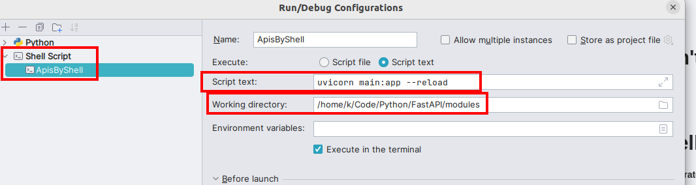
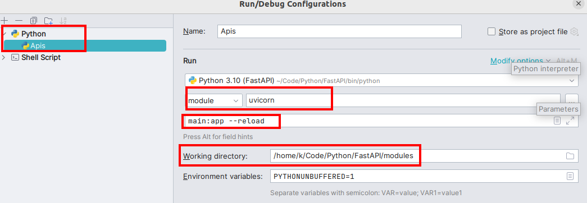

# Installing Modules
* go into Main folder and run **make install** command

# Run app by terminal (Can't debug)
 **uvicorn main:app --reload** 
 
# Run app by Pycharm Shell Settings
* Make sure in specific location your main.py should exist with @app decorator
* Add select shell script add executable command with **accurate working directory path**

# Run app by Pycharm Python App Settings
* Make sure in specific location your main.py should exist with @app decorator
* Only this method will **allow to debug application in pyCharm**
* select python, add module and command related to module and **accurate working directory path**

